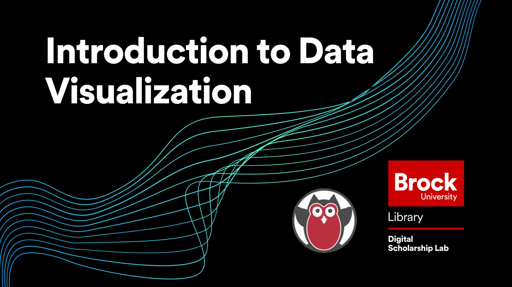

# Introduction to Data Visualization
The goal of this session is to provide a description and explanation of the What, Why, and How of visualizations.  This workshop will cover:

- What a data visualization is
- Why are they important
- What some of the popular tools are for making data visualizations
- Best practices
- And last an activity where we will make some basic data visualizations

*Estimated length of workshop: 1 hour*

----

## Next Steps

The best thing you can do is keep making visualizations using as many tools as possible to built your experience.  Also looking at examples others have made can help inspire you like [Tableau's Viz of the Day](https://public.tableau.com/app/discover/viz-of-the-day).

----

**This workshop is brought to you by the Brock University Digital Scholarship Lab.  For a listing of our upcoming workshops go to [Experience BU](https://experiencebu.brocku.ca/organization/dsl) if you are a Brock affiliate or [Eventbrite page](https://www.eventbrite.ca/o/brock-university-digital-scholarship-lab-21661627350) for external attendees.  For additional inquiries, contact [DSL@Brocku.ca](mailto:DSL@Brocku.ca)**

